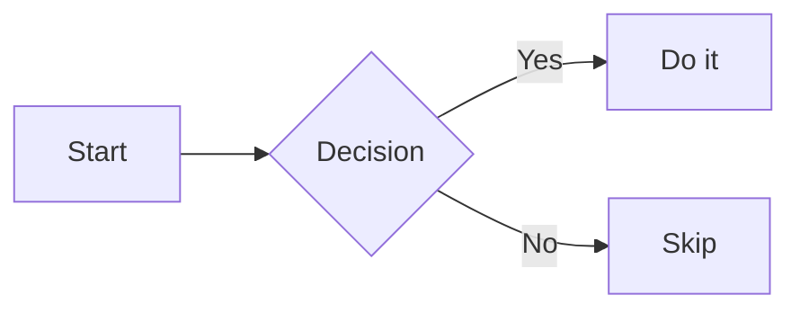
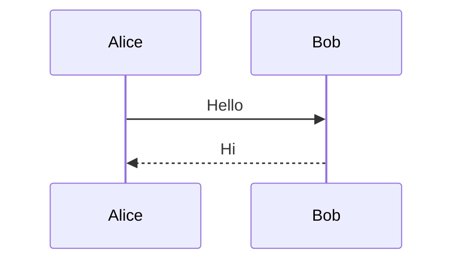
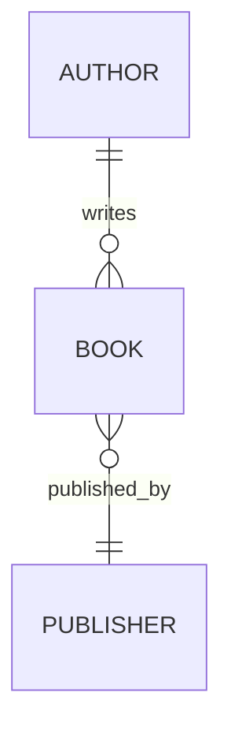

# Diagrams

## Flowchart

```mermaid
graph LR
    A[Start] --> B{Decision}
    B -->|Yes| C[Do it]
    B -->|No| D[Skip]
```

## Sequence

```mermaid
sequenceDiagram
    Alice->>Bob: Hello
    Bob-->>Alice: Hi
```

## Entity relationship

```mermaid
erDiagram
    AUTHOR ||--o{ BOOK : writes
    BOOK }o--|| PUBLISHER : published_by
```
